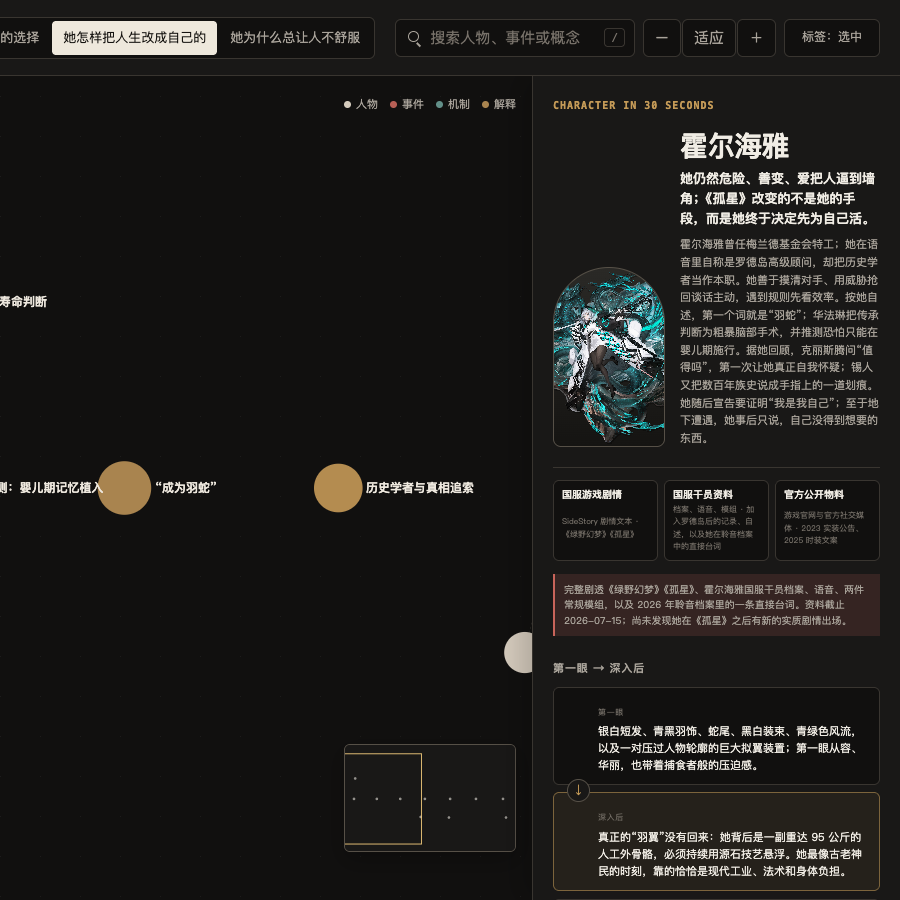
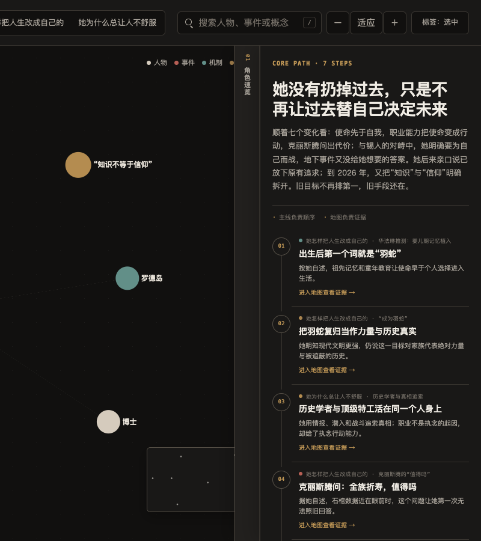
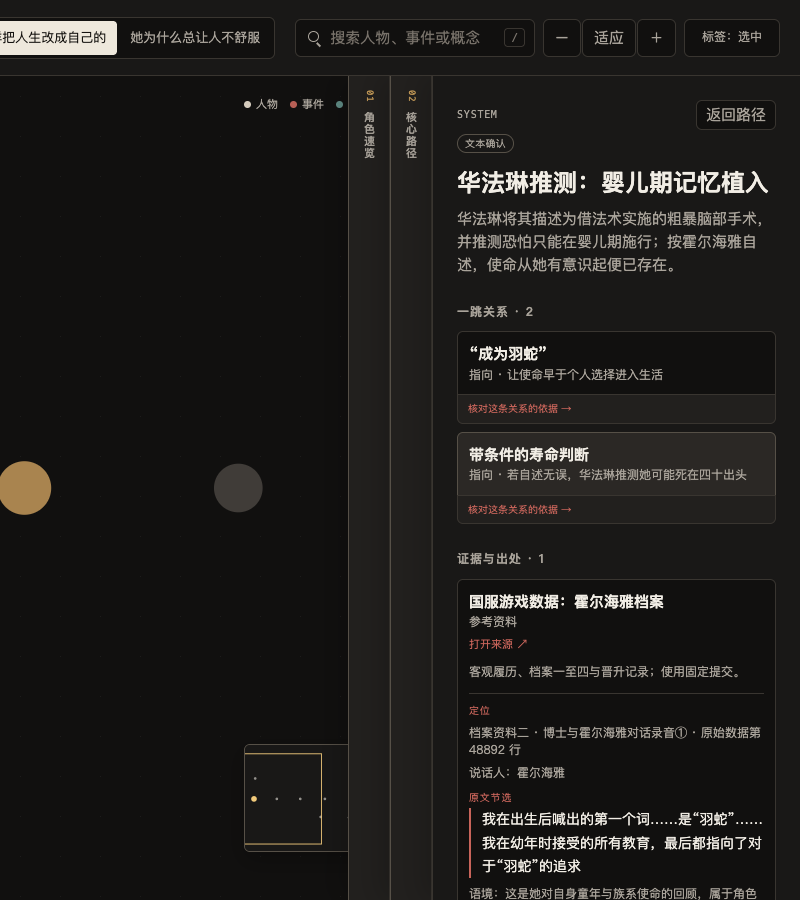

# MrCarlsama Character Insight Canvas · 角色洞察画板

[](https://github.com/MrCarlsama/MrCarlsama-Character-Insight-Canvas/stargazers)
[](./skills/mrcarlsama-character-insight-canvas/SKILL.md)
[](./skills/mrcarlsama-character-insight-canvas/references/renderer-contract.md)
[](./skills/mrcarlsama-character-insight-canvas/references/verification-contract.md)
[](./skills/mrcarlsama-character-insight-canvas/tests)

`mrcarlsama-character-insight-canvas` 是一个面向 Codex 和其他本地 Agent 的角色研究工作流 Skill。公开资料、剧本、字幕和设定集会被整理成一份真正能看懂角色、还能一路回到原文的只读探索画板。

**输入一个角色和资料范围，最后只交付一个离线可打开的 HTML。** 读者先在“角色速览”里认识这个人，再沿核心路径看她如何走到现在；对某个判断有疑问时，可以继续打开地图、节点和关系，核对具体章节、台词、说话人和上下文。

不是设定百科，也不是没有出处的角色小传。

**角色速览：第一屏先回答“她是谁”**



> 从“她是谁”进入人物变化，再沿证据地图回到原文。

[30 秒开始](#30-秒开始) · [效果展示](#效果展示) · [适合什么任务](#适合什么任务) · [工作方式](#工作方式)

> **仓库边界：** 这里提供研究流程、数据模板、独立核验规范和质量门槛，不内置通用渲染器。Agent 运行时会先寻找工作区里的兼容渲染器；找不到且用户明确需要 HTML 时，再按 [`renderer-contract.md`](./skills/mrcarlsama-character-insight-canvas/references/renderer-contract.md) 实现最小可用版本。上图来自经过这套流程验收的配套本地渲染器。

## 30 秒开始

仓库已经发布到 GitHub。由于目前尚未指定开源许可证，以下命令暂供仓库所有者自用，或供已经获得明确许可的人安装。

### 1. 安装

```bash
npx skills add https://github.com/MrCarlsama/MrCarlsama-Character-Insight-Canvas \
  --skill mrcarlsama-character-insight-canvas \
  --global --yes
```

也可以直接把这段话发给有 Shell 权限的 Agent：

```text
帮我安装 mrcarlsama-character-insight-canvas。
请运行：npx skills add https://github.com/MrCarlsama/MrCarlsama-Character-Insight-Canvas --skill mrcarlsama-character-insight-canvas --global --yes
安装后运行包审计和测试，并告诉我是否全部通过。
```

如果已经安装过，使用 `npx skills update -g mrcarlsama-character-insight-canvas` 更新；本地手动副本则按后面的[升级方法](#升级现有安装)处理。

### 2. 对 Agent 说

```text
$mrcarlsama-character-insight-canvas

深度研究《明日方舟》里的霍尔海雅。
使用公开可查资料，允许完整剧透。
重点解释她是谁、最鲜明的做事方式、关键关系和变化过程。
最后只交付一个可离线打开的 HTML。
```

### 3. 拿到成品

```text
作品名_角色名_角色洞察画板.html
```

成品内嵌角色数据、CSS、JavaScript、Canvas / WebGL 画板、必要图片和证据锚点。双击即可打开，不需要本地服务器，也不依赖旁边的 JSON 或图片目录。

## 你会得到什么

- 👤 **角色速览**：一句话判断、第一眼与深入后、身份、鲜明特点、核心矛盾、关键关系和视觉印象；
- 🧭 **核心路径**：用五到九个真正改变角色的节点，串起她怎么走到现在；
- 🗺️ **按问题生成的证据地图**：地图数量不固定，只为材料里确实需要回答的问题存在；
- 🔎 **能回到原文的节点和关系**：显示来源、精确位置、节选、说话人、语境，以及这段材料究竟支持什么；
- 🧪 **两轮独立核验**：先检查研究论断，再检查最终画板有没有把“可能”写成“必然”、把角色自述写成客观事实；
- ⚡ **可缩放的只读无限画板**：支持搜索、缩放、适配、地图切换、小地图和折叠式抽屉；
- 📄 **单文件 HTML**：初始打开不请求外部脚本、样式或数据，WebGL 不可用时仍保留可读内容。

游戏、动画、漫画、小说、电影、舞台剧和广播剧都可以研究。不同改编、路线和版本也能比较，但不会悄悄混在一起。

## 效果展示

下面的截图来自《明日方舟》霍尔海雅测试案例。案例不属于 Skill 模板，也不会把霍尔海雅的结论带进下一次研究。

### 核心路径：先看变化，不先背完整年表



主线只保留理解角色变化所必需的步骤。每一步都能进入对应地图，查看这一判断由哪些事件、人物或机制托住。

### 证据抽屉：上一层不会消失



新的路径会盖住旧抽屉，但会留下带文字的窄边。读者既能继续往深处走，也能看见自己从哪里来。最深一层展示精确出处、原文节选、说话人、必要语境和支持边界。

这个测试案例最终形成了一个角色速览入口、七步核心路径和三张按问题生成的证据地图。案例 HTML、研究数据和配套渲染器不在本仓库中；截图只证明产出形态，不冒充仓库内可直接复现的示例工程。

> 截图只用于展示 Skill 的产出形态。《明日方舟》及角色视觉素材的相关权利归原权利方所有；本仓库不内置该案例的角色结论和游戏资料。

## 适合什么任务

**适合：**

- 深度理解一个角色，而不是只收集基础设定；
- 把散落在剧情、档案、语音、访谈和视觉物料里的信息合在一起；
- 研究性格、行为模式、核心矛盾、关键关系和变化过程；
- 比较动画、漫画、游戏或不同路线中的角色差异；
- 根据自己的剧本、字幕、设定集或采访制作可探索报告；
- 为写作、视频策划、Cosplay、摄影和同人创作建立人物理解底稿；
- 更新已有画板，补足视觉印象、关系证据或原文出处。

**不适合：**

- 只要一张百科人物卡或静态海报；
- 希望 Agent 在没有出处时替角色补全“官方设定”；
- 要求把 Wiki、转载页面或同人视觉当成不可质疑的一手证据；
- 没有独立核验条件，却仍要声称报告已经交叉验证；
- 需要多人实时协作编辑同一份画板。

## 常见用法

| 任务 | 推荐说法 |
| --- | --- |
| 公开资料研究 | 指定角色、作品、剧透范围和最想解决的问题 |
| 使用自己的材料 | 明确“优先使用我提供的剧本、字幕和设定集，公开网络只补缺” |
| 比较不同改编 | 写清漫画、动画、游戏或路线边界，要求共同事实合并、冲突保留标签 |
| 服务创作项目 | 说明后续用于写作、视频、Cosplay 或摄影，要求突出行为、关系与视觉线索 |
| 更新旧报告 | 直接提供旧 HTML 或数据，说明需要补哪些入口、证据或兼容性 |

### 使用自己的材料

```text
$mrcarlsama-character-insight-canvas

根据我提供的剧本、字幕和设定集研究这个角色。
优先使用这些原始材料；公开网络只用于补缺，不要拿 Wiki 覆盖原文。
最后只交付一个单文件 HTML。
```

### 限定改编和剧透范围

```text
$mrcarlsama-character-insight-canvas

只研究动画第一季里的这个角色，不使用漫画后续剧情。
把动画已经确认的内容和只能推测的部分分开。
```

### 比较不同版本

```text
$mrcarlsama-character-insight-canvas

比较这个角色在漫画、动画和游戏改编中的差异。
共同事实合并，冲突内容保留版本标签。
只有确实帮助理解角色时，才增加版本差异地图。
```

## 为什么不只是另一份 AI 人物小传

普通角色分析往往只留下结论。这个 Skill 会把用户看到的每一句判断连回一条可核验的路径：

```text
画板判断
  ↓
原子论断
  ↓
来源与精确位置
  ↓
原文节选 / 可观察事实
  ↓
说话人、语境和适用条件
  ↓
这段材料能够支持到什么程度
```

角色自己说过的话，只能先证明“她这样说过”；先后发生的两件事，也不会自动被写成因果。Wiki 可以帮助定位，但不能因为换了三个网址就算成三份独立来源。

真正无法确认的内容会保留为不足、冲突或带条件的解释，而不是被顺手润色成确定事实。详细规则见 [`research-contract.md`](./skills/mrcarlsama-character-insight-canvas/references/research-contract.md) 和 [`verification-contract.md`](./skills/mrcarlsama-character-insight-canvas/references/verification-contract.md)。

## 工作方式

对使用者来说，一次任务只有四段：

1. **定边界**：确认角色、作品、改编、版本、路线和剧透范围；
2. **做研究**：拆开事实、自述、视觉观察和报告解释，再由独立子 Agent 逐条核验；
3. **做画板**：先写角色速览和核心路径，再按真实问题生成必要地图；
4. **验收交付**：复核画板文字，运行案例审计和浏览器检查，最后只交付 HTML。

Agent 内部执行的是更严格的八步流程。完整规范见 [`SKILL.md`](./skills/mrcarlsama-character-insight-canvas/SKILL.md)，验收规则见 [`quality-gates.md`](./skills/mrcarlsama-character-insight-canvas/references/quality-gates.md)。

## 平台与运行条件

| 环境 | 状态 | 说明 |
| --- | --- | --- |
| Codex | Skill 包已验证 | 能读写文件、运行脚本、调用真实浏览器并创建独立子 Agent 时，可完成完整流程；HTML 仍需工作区里的兼容渲染器或运行时实现 |
| 其他本地 Agent | 可适配 | 需要支持 Skill 扫描、Shell、浏览器验收和独立上下文；安装目录按平台调整 |
| 普通聊天机器人 | 不推荐 | 没有文件系统、浏览器和独立核验能力时，只能停在研究草稿，不能声称完成最终画板 |

自动检查脚本需要 Node.js。最终 HTML 本身不需要 Node.js，也不需要服务器。

## 完整安装

以下命令只用于仓库所有者自用，或已经获得明确许可的环境。

### 方式一：从 GitHub 安装（推荐）

```bash
npx skills add https://github.com/MrCarlsama/MrCarlsama-Character-Insight-Canvas \
  --skill mrcarlsama-character-insight-canvas \
  --global --yes
```

### 方式二：从本地仓库安装

Codex 用户级安装：

```bash
mkdir -p ~/.codex/skills
cp -R skills/mrcarlsama-character-insight-canvas ~/.codex/skills/
```

只希望当前项目使用时：

```bash
mkdir -p .agents/skills
cp -R skills/mrcarlsama-character-insight-canvas .agents/skills/
```

### 升级现有安装

不要用 `cp -R` 原地覆盖同名目录。新版删掉的旧文件会继续残留，最后很难判断 Agent 实际读到的是哪套内容。

<details>
<summary>查看安全升级命令</summary>

```bash
mkdir -p ~/.codex/skill-backups
mv ~/.codex/skills/mrcarlsama-character-insight-canvas \
  ~/.codex/skill-backups/mrcarlsama-character-insight-canvas-previous
cp -R skills/mrcarlsama-character-insight-canvas ~/.codex/skills/
```

如果备份名称已经存在，先换一个没有使用过的名称。项目级安装同理：先把旧目录整体移出 `.agents/skills/`，再复制完整新目录。

</details>

<details>
<summary>从旧名称 character-insight-canvas 迁移</summary>

不要让新旧两个 Skill 长期共存，否则模型可能同时看到两个近似触发器。

```bash
mkdir -p ~/.codex/skill-backups
mv ~/.codex/skills/character-insight-canvas \
  ~/.codex/skill-backups/character-insight-canvas
cp -R skills/mrcarlsama-character-insight-canvas ~/.codex/skills/
```

旧目录不存在时跳过 `mv`。

</details>

### 验证安装

```bash
node ~/.codex/skills/mrcarlsama-character-insight-canvas/scripts/audit-package.mjs
node --test ~/.codex/skills/mrcarlsama-character-insight-canvas/tests/*.test.mjs
```

安装完成后请新建一个任务。已经打开的任务通常不会自动刷新 Skill 清单。

<details>
<summary><strong>维护者：开发、自检与仓库结构</strong></summary>

## 开发与验证

### 检查 Skill 包

```bash
node skills/mrcarlsama-character-insight-canvas/scripts/audit-package.mjs
node --test skills/mrcarlsama-character-insight-canvas/tests/*.test.mjs
```

### 新建并检查角色案例

```bash
node skills/mrcarlsama-character-insight-canvas/scripts/scaffold.mjs \
  --character "角色名" \
  --work "作品名" \
  --output "<temporary-work-dir>/character.canvas.json"

node skills/mrcarlsama-character-insight-canvas/scripts/audit-case.mjs \
  --input "<temporary-work-dir>/character.canvas.json" \
  --ledger "<temporary-work-dir>/character.claims.json" \
  --verification "<temporary-work-dir>/character.verification.json"
```

脚手架故意保留占位符和未核验状态。空模板直接送进案例审计必须失败，避免被误当成已经完成的研究。

## 仓库结构

```text
.
├── README.md
├── docs/
│   └── assets/                 # README 效果截图，不进入 Skill 包
└── skills/
    └── mrcarlsama-character-insight-canvas/
        ├── SKILL.md            # 八步执行流程
        ├── references/         # 研究、核验、叙事、渲染和质量契约
        ├── templates/          # 画板、论断台账和核验报告模板
        ├── scripts/            # 脚手架与审计脚本
        └── tests/              # Skill 自动测试
```

</details>

## 三条硬边界

- **地图跟问题走**：没有固定三张图的模板，能合并就合并，没有独立问题就不画；
- **只读保证证据对应关系**：成品不会在浏览时悄悄改写，画板文字才能继续对应已经核验过的材料；
- **单文件控制交付复杂度**：用户不需要理解内部 JSON、运行构建命令或维护一堆旁路文件。

## 常见问题

### 一定会生成三张证据地图吗？

不会。地图由角色材料里真正需要回答的问题决定。两张图解决同一件事就合并，一个问题撑不起一张图就不画。

### 只有公开资料也能做吗？

可以，但“网上能找到”和“可靠”不是一回事。Agent 会区分作品正文、官方材料、二手重建、Wiki、评论和视觉再诠释，并尽量追到最初出处。

### 安装后，当前任务为什么看不到 Skill？

已有任务通常不会重新扫描 Skill 目录。先运行验证命令，确认文件和测试正常，再新建一个任务调用 `$mrcarlsama-character-insight-canvas`。

### 没有 WebGL 怎么办？

最终 HTML 仍应可读。图形效果可以降级，角色速览、核心路径、文字目录、证据卡和来源不能跟着消失。

### 可以直接公开发布成品吗？

内容核验通过不等于已经获得发布许可。公开前仍需单独检查引用长度、图片版权、隐私和目标平台规则。

## 许可证

本仓库虽然公开可见，但目前尚未指定开源许可证，默认不授予第三方复制、修改或再发布权限。上面的安装命令暂供仓库所有者自用，或供已经获得明确许可的人使用；正式开放给社区前，必须先选择许可证并补充对应的 `LICENSE` 文件。
