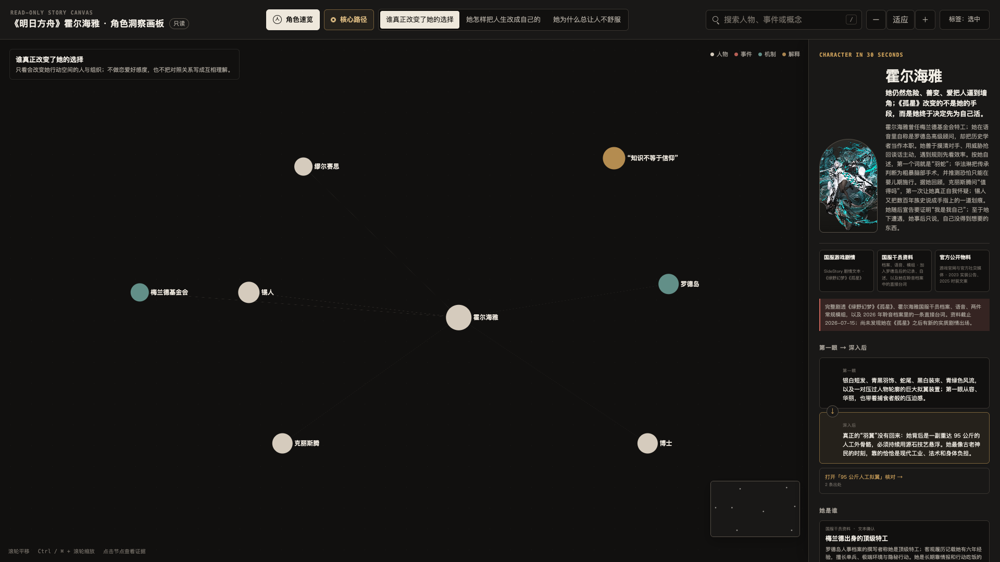
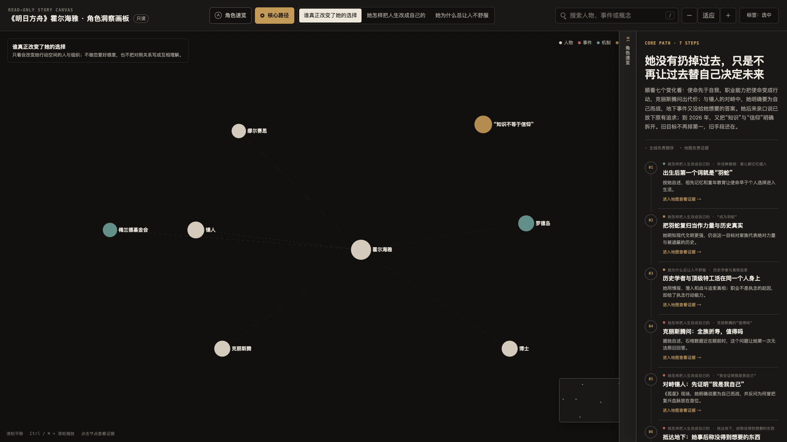
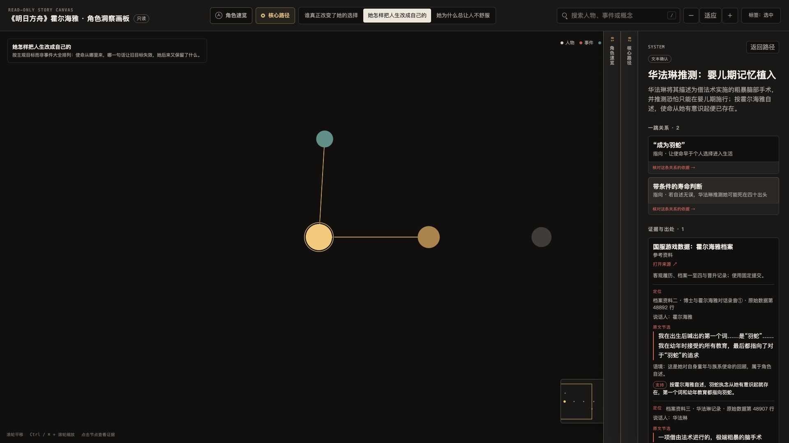

# MrCarlsama Character Insight Canvas

[](https://github.com/MrCarlsama/MrCarlsama-Character-Insight-Canvas/stargazers)
[](./skills/mrcarlsama-character-insight-canvas/SKILL.md)
[](./skills/mrcarlsama-character-insight-canvas/references/renderer-contract.md)
[](./skills/mrcarlsama-character-insight-canvas/tests)

这是一个研究虚构角色的 Agent Skill。它会整理公开资料，或用户提供的剧本、字幕和设定集，核对关键判断，最后生成一份可以离线打开的 HTML。

人物资料常见的问题是：信息收集得很全，却说不清这个人为什么会这样行动；分析写得很顺，却找不到原文出处。这个 Skill 把人物经历和变化放在正文，把关系、事件与出处放进可展开的画板。读者可以先顺着主线读，再按需要核对证据。

游戏、动画、漫画、小说、电影、舞台剧和广播剧都可以研究。遇到不同改编、路线或版本时，报告会保留各自的边界，不会把互相冲突的材料混成一个结论。

[示例](#示例) · [安装](#安装) · [使用](#使用) · [生成的-html](#生成的-html) · [资料与引用](#资料与引用) · [工作流程](#工作流程)

## 示例

下面是《明日方舟》霍尔海雅研究案例。三张图均保留完整浏览器界面，可以点击查看原尺寸。

### 角色速览

报告开头集中说明角色身份、行为习惯、主要矛盾、关键关系和视觉特征。需要核对某项判断时，可以直接进入对应出处。

<a href="./docs/assets/character-overview.png">
  
</a>

### 核心路径

人物变化按先后顺序整理成一条主线。这里只保留影响角色选择和目标的关键节点，相关人物、事件和机制留在证据地图中展开。

<a href="./docs/assets/core-path.png">
  
</a>

### 证据抽屉

从路径或地图节点继续深入时，新抽屉会覆盖上一层，同时留下带标题的窄边。最深一层列出来源、定位、说话人、原文节选、语境，以及这段材料能够支持到什么程度。

<a href="./docs/assets/evidence-drawer.png">
  
</a>

示例数据和配套渲染器不随本仓库发布。截图仅用于说明产出形态；《明日方舟》及角色视觉素材的相关权利归原权利方所有。

## 安装

仓库目前没有开源许可证。以下命令暂供仓库所有者自用，或供已经取得明确许可的人安装。

```bash
npx skills add https://github.com/MrCarlsama/MrCarlsama-Character-Insight-Canvas \
  --skill mrcarlsama-character-insight-canvas \
  --global --yes
```

安装完成后请新建一个任务。已经打开的任务通常不会自动刷新 Skill 清单。

如果已经通过 `npx skills` 安装，可以这样更新：

```bash
npx skills update -g mrcarlsama-character-insight-canvas
```

本地安装、旧名称迁移和开发命令放在后面的[维护与开发](#维护与开发)中。

## 使用

在请求中点名 Skill，并写清角色、作品、资料范围和剧透边界。例如：

```text
$mrcarlsama-character-insight-canvas

深度研究《明日方舟》里的霍尔海雅。
使用公开可查资料，允许完整剧透。
重点解释她的身份、做事方式、关键关系和变化过程。
最后只交付一个可以离线打开的 HTML。
```

这些条件会直接影响研究结果：

- 作品、角色，以及使用哪个译名；
- 游戏路线、动画季度、漫画卷数等版本范围；
- 是否允许剧透；
- 优先使用公开资料，还是用户提供的剧本、字幕、设定集；
- 最想弄清的问题，例如性格、关系、行为动机、视觉印象或版本差异。

<details>
<summary>使用自己的材料</summary>

```text
$mrcarlsama-character-insight-canvas

根据我提供的剧本、字幕和设定集研究这个角色。
这些原始材料优先；公开网络只用于补缺，不要用 Wiki 覆盖原文。
最后只交付一个单文件 HTML。
```

</details>

<details>
<summary>比较不同版本</summary>

```text
$mrcarlsama-character-insight-canvas

比较这个角色在漫画、动画和游戏改编中的差异。
共同事实可以合并，冲突内容保留版本标签。
只有确实有助于理解角色时，才增加版本差异地图。
```

</details>

## 生成的 HTML

一份完整报告通常包括：

- **角色速览**：身份、做事方式、主要矛盾、关键关系和视觉印象；
- **核心路径**：用少量关键节点说明角色的目标和选择怎样发生变化；
- **证据地图**：围绕研究中真正出现的问题组织人物、事件、机制和解释，地图数量不预设；
- **出处抽屉**：记录来源、精确位置、原文节选、说话人、语境和支持边界；
- **离线文件**：数据、样式、脚本、Canvas / WebGL 画板和必要图片都放在同一个 HTML 里。

画板只读。浏览过程不会改写已经核验过的文字，也不会破坏结论与证据的对应关系。WebGL 不可用时，图形效果可以降级，但人物正文、核心路径、证据卡和来源仍需保持可读。

## 资料与引用

报告中的重要判断会沿着下面这条链路回到材料：

```text
画板中的判断
  ↓
可单独核验的论断
  ↓
来源与精确位置
  ↓
原文节选或可观察事实
  ↓
说话人、语境和适用条件
  ↓
这段材料能够支持到什么程度
```

角色说过的话，首先只能证明“她这样说过”；前后发生的两件事，也不能自动写成因果。Wiki 和资料站可以帮助定位，真正下结论时仍要尽量回到作品正文、官方档案或可以固定版本的原始数据。

研究完成后，由独立子 Agent 检查论断、出处和推理边界；HTML 写完后，再检查一次画板文案，避免把推测改写成事实，或把角色自述写成客观记录。具体规则见 [`research-contract.md`](./skills/mrcarlsama-character-insight-canvas/references/research-contract.md) 和 [`verification-contract.md`](./skills/mrcarlsama-character-insight-canvas/references/verification-contract.md)。

## 适用范围

这个 Skill 适合用来梳理一个角色的性格、行动方式、核心矛盾、关系变化和视觉线索，也适合为写作、视频策划、Cosplay、摄影或同人创作准备人物底稿。只有公开资料也能工作；如果手头有剧本、字幕、设定集或采访，直接提供原始材料通常会得到更扎实的结果。

如果需求只是一张百科人物卡、静态海报，或几句不要求出处的简介，使用这个流程反而显得过重。它也不适合多人实时编辑同一份画板。

## 工作流程

1. 确认角色、作品、改编版本、路线和剧透范围；
2. 收集材料，把事实、角色自述、视觉观察和研究者解释分开记录；
3. 由独立子 Agent 核对关键论断、来源和不确定项；
4. 整理角色正文、核心路径和必要地图，生成 HTML 后运行数据审计与浏览器检查。

地图跟着问题生成，不固定为三张。两个问题能够合并，就使用一张图；材料不足以支撑独立问题，就不单独画图。

完整执行规范见 [`SKILL.md`](./skills/mrcarlsama-character-insight-canvas/SKILL.md)，验收条件见 [`quality-gates.md`](./skills/mrcarlsama-character-insight-canvas/references/quality-gates.md)。

## 运行条件

| 环境 | 说明 |
| --- | --- |
| Codex | 具备文件读写、Shell、真实浏览器和独立子 Agent 时，可以执行完整流程 |
| 其他本地 Agent | 需要支持 Skill 扫描、Shell、浏览器验收和彼此独立的核验上下文 |
| 普通聊天机器人 | 缺少文件系统、浏览器或独立核验能力时，只能完成研究草稿 |

自动检查脚本需要 Node.js。最终 HTML 不需要 Node.js，也不需要本地服务器。

这个仓库保存研究流程、数据模板、核验规范和测试，不内置通用渲染器。Agent 会先在当前工作区寻找符合 [`renderer-contract.md`](./skills/mrcarlsama-character-insight-canvas/references/renderer-contract.md) 的渲染器；找不到且用户明确需要 HTML 时，再按同一契约实现满足交付要求的版本。

## 维护与开发

<details>
<summary>本地安装与旧名称迁移</summary>

Codex 用户级安装：

```bash
mkdir -p ~/.codex/skills
cp -R skills/mrcarlsama-character-insight-canvas ~/.codex/skills/
```

只在当前项目使用：

```bash
mkdir -p .agents/skills
cp -R skills/mrcarlsama-character-insight-canvas .agents/skills/
```

升级手动安装的副本时，不要用 `cp -R` 直接覆盖同名目录。先移走旧目录，再复制完整新目录，避免已经删除的旧文件残留。

```bash
mkdir -p ~/.codex/skill-backups
mv ~/.codex/skills/mrcarlsama-character-insight-canvas \
  ~/.codex/skill-backups/mrcarlsama-character-insight-canvas-previous
cp -R skills/mrcarlsama-character-insight-canvas ~/.codex/skills/
```

旧名称 `character-insight-canvas` 也应整体移出 Skill 目录，不要让两个近似触发器长期共存。

</details>

<details>
<summary>包检查、测试与案例脚手架</summary>

```bash
node skills/mrcarlsama-character-insight-canvas/scripts/audit-package.mjs
node --test skills/mrcarlsama-character-insight-canvas/tests/*.test.mjs
```

新建角色案例：

```bash
node skills/mrcarlsama-character-insight-canvas/scripts/scaffold.mjs \
  --character "角色名" \
  --work "作品名" \
  --output "<temporary-work-dir>/character.canvas.json"
```

检查案例数据、论断台账和核验记录：

```bash
node skills/mrcarlsama-character-insight-canvas/scripts/audit-case.mjs \
  --input "<temporary-work-dir>/character.canvas.json" \
  --ledger "<temporary-work-dir>/character.claims.json" \
  --verification "<temporary-work-dir>/character.verification.json"
```

脚手架会保留占位符和未核验状态。空模板送进案例审计时应当失败，避免它被误当成已经完成的研究。

</details>

<details>
<summary>仓库结构</summary>

```text
.
├── README.md
├── docs/
│   └── assets/                 # README 示例截图，不进入 Skill 包
└── skills/
    └── mrcarlsama-character-insight-canvas/
        ├── SKILL.md            # 执行流程
        ├── references/         # 研究、核验、叙事、渲染和质量规范
        ├── templates/          # 画板、论断台账和核验报告模板
        ├── scripts/            # 脚手架与审计脚本
        └── tests/              # 自动测试
```

</details>

## 常见问题

### 证据地图一定是三张吗？

不一定。地图数量由材料里真正需要回答的问题决定，能够合并就合并，没有足够材料就不单独建立。

### 只有公开资料也能研究吗？

可以。Agent 会区分作品正文、官方材料、二手重建、Wiki、评论和视觉再诠释，并尽量追到最初出处。“网上能找到”不等于“已经证实”。

### 安装后，当前任务为什么看不到 Skill？

已有任务通常不会重新扫描 Skill 目录。确认安装完成后，新建一个任务，再调用 `$mrcarlsama-character-insight-canvas`。

### 没有 WebGL 怎么办？

最终 HTML 仍应可读。人物正文、核心路径、文字目录、证据卡和来源不能随图形效果一起消失。

### 成品可以直接公开吗？

研究内容通过核验，不代表已经取得发布许可。公开前仍需检查引用长度、图片版权、隐私和目标平台规则。

## 许可证

本仓库虽然公开可见，但目前没有开源许可证，默认不授予第三方复制、修改或再发布权限。正式开放给社区前，需要先选择许可证并添加 `LICENSE` 文件。
